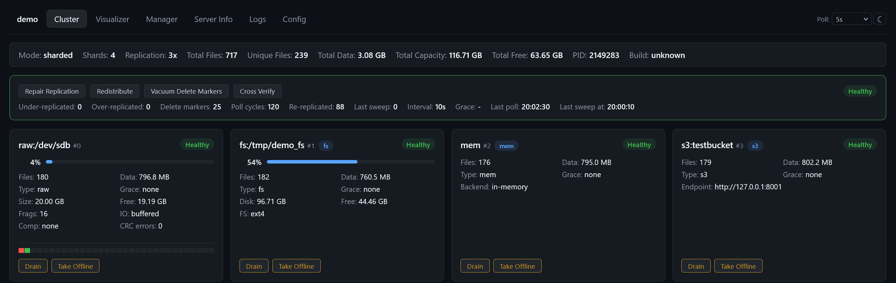
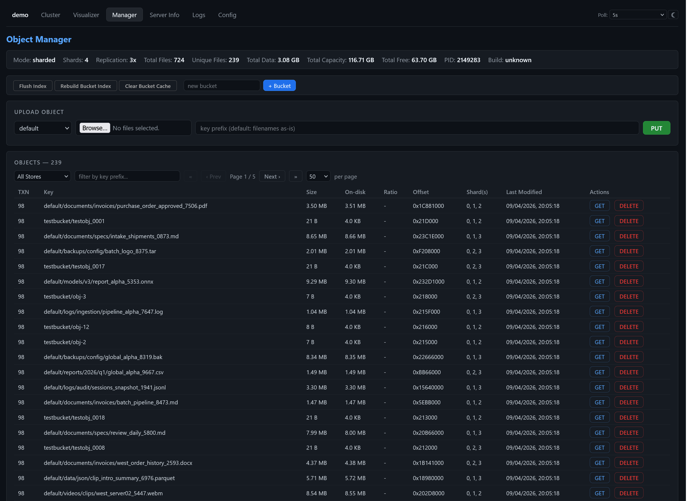
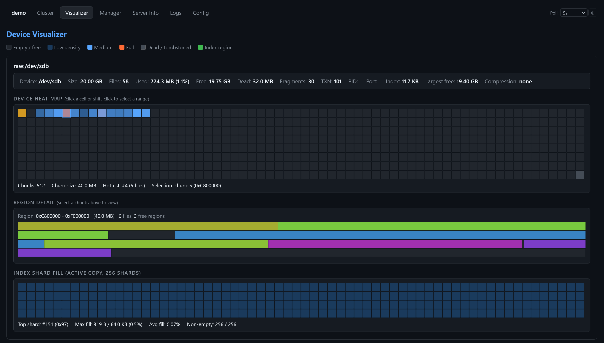
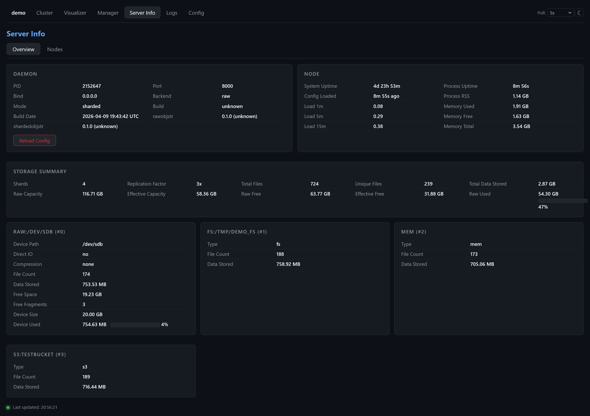
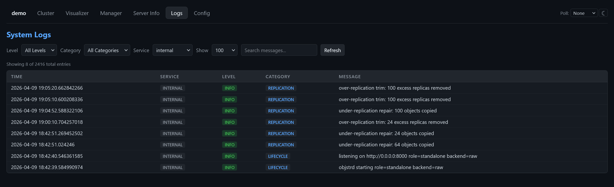
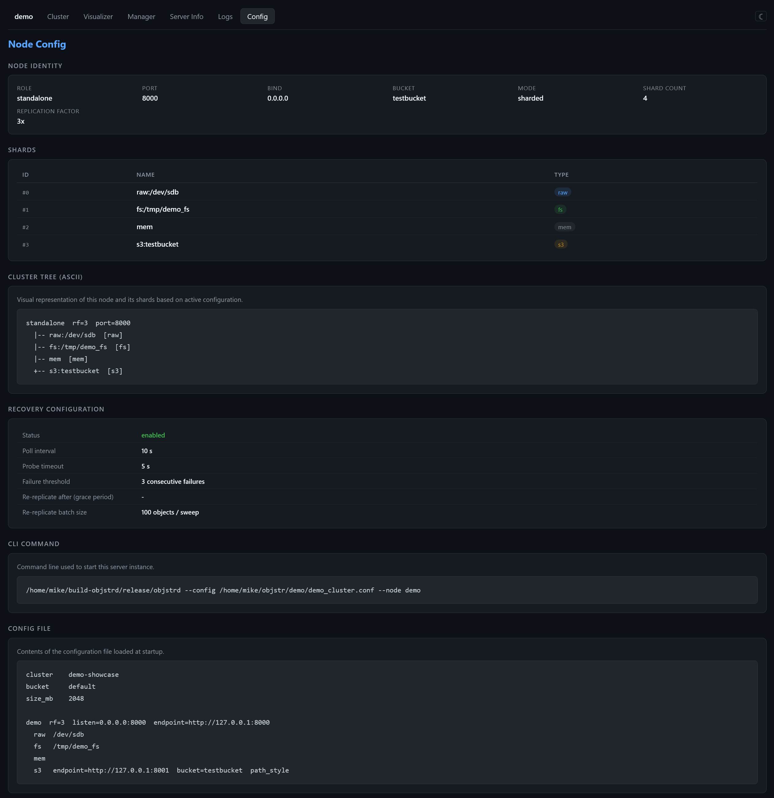

# objstr

A composable object store built from snap-together pieces. Every layer implements the same `ObjectStore` trait, so you can stack them together: raw block devices, sharded clusters, S3 endpoints, local directories - mix, nest, and replicate however you want. One binary serves any combination as S3.

---

## The Crates

### rawobjstr - the storage engine

Every object is a **single contiguous extent** on disk. A 128 MB Parquet file is one `pread()` with no block reassembly, no scatter-gather. O_DIRECT bypasses the kernel page cache entirely, and contiguous layout means the NVMe controller gets one sequential command instead of thousands of random 4 KB reads.

Hardware-accelerated CRC32c on every block. Crash-safe double-buffered index. Transparent zstd/snappy/gzip compression. A built-in event socket broadcasts every PUT, DELETE, and FLUSH in real time over a Unix socket - subscribers can react instantly without polling.

Use it standalone as a high-speed backing store for analytics workloads - point LanceDB, DataFusion, DuckDB, or PyArrow at it via the `ObjectStore` trait and get bare-metal scan performance on Parquet, Lance, and IPC files without S3 overhead. Works on raw block devices (`/dev/nvme0n1`), loopback image files, or any seekable file - no filesystem required. Or use it as a building block inside shardedobjstr, where each shard in a replicated cluster is an independent rawobjstr instance managing its own device.

[rawobjstr documentation](rawobjstr/README.md)

---

### shardedobjstr - sharding and replication

Compose arbitrary backends into one logical store: raw block devices, local directories, S3 endpoints, even in-memory stores for testing. Objects are placed via jump consistent hash and replicated to N shards concurrently. A placement catalog tracks where every object lives.

Use it standalone to stripe multiple NVMe drives into a single `ObjectStore` with no S3 layer and no HTTP overhead just direct in-process access. Aggregate 4 NVMe devices into one pool, replicate across them for redundancy, and tier cold data to an S3 bucket, all behind one interface. Or mix a fast local filesystem directory with a couple of raw devices when you want some objects on ext4 and others on bare metal. Add drives, remove drives, or swap backends without changing application code.

Nest clusters inside clusters: a root node replicates to children that manage their own shards independently. When a shard goes offline, reads transparently fail over to surviving replicas and background repair restores the replication factor.

It also powers objstrd under the hood the daemon wraps a sharded cluster in an S3 protocol layer and adds admin APIs, background recovery, and a web UI. But S3 is optional shardedobjstr works just as well as a pure library.

[shardedobjstr documentation](shardedobjstr/README.md)

---

### objstrd - the S3 daemon

A single binary that turns any combination of raw devices, images, directories, or upstream S3 into an S3-compatible HTTP endpoint.

**Cluster dashboard** - shard health, replication status, and storage distribution at a glance.



**Object manager** - browse, upload, and delete objects across buckets. See size, shard placement, and on-disk offset for every object.



**Device visualizer** - heat map of extent allocation on raw block devices. Click a chunk to inspect individual files and free regions.



**Server info** - daemon identity, system load, memory usage, and per-shard storage breakdown.



**System logs** - filterable replication, lifecycle, and error events with timestamps and categories.



**Node config** - live view of shard topology, recovery settings, and the config file that started the server.



**objstrd sits on top of both libraries** - it presents the S3 protocol to clients, delegates storage to shardedobjstr for multi-shard clusters or directly to rawobjstr for single-device mode.

It can be used as a passthrough proxy: point it at an existing S3, R2, or MinIO endpoint and it re-serves the data as its own S3 endpoint with the admin UI on top. Combine a remote S3 shard with local storage in the same cluster to use it as a caching proxy.

[objstrd documentation](objstrd/README.md)

---

## How They Fit Together

The three crates form a layered stack where each layer does exactly one job:

```
                S3 clients (aws-cli, boto3, rclone, LanceDB)
                              |
                    +---------+---------+
                    |      objstrd      |   S3 protocol, admin UI,
                    |  (HTTP + daemon)  |   background recovery
                    +---------+---------+
                              |
                   +----------+----------+
                   |   shardedobjstr     |   Sharding, replication,
                   | (placement + repair)|   catalog, failover
                   +---+------+------+---+
                       |      |      |
                    +--+--+ +-+--+ +-+--+
                    | raw | | raw| | S3 |   Per-shard storage:
                    | obj | | obj| | or |   block device, loopback,
                    | str | | str| | fs |   filesystem, or remote S3
                    +-----+ +----+ +----+
                      |        |
                   /dev/sdb  /tmp/store.img
```

**rawobjstr** owns the bytes on disk: extent allocation, CRC integrity, compression, crash recovery, and the index that maps keys to byte ranges on a single device. It exposes the standard `ObjectStore` trait so anything above it can swap in a different backend without code changes.

**shardedobjstr** distributes objects across multiple rawobjstr instances (or any mix of backends). It decides which shards hold each object, writes replicas concurrently, tracks placement in a catalog, and repairs replication when shards fail. It also implements `ObjectStore`, so the layer above never sees the complexity.

**objstrd** translates S3 HTTP requests into ObjectStore calls. It handles metadata encoding (user headers become TLV-encoded suffixes on raw shards), multipart assembly, delete markers, bucket management, and background health polling. The web UI and admin endpoints give operators visibility into the entire stack.

When a client does `PUT /my-bucket/data.parquet`, the request flows: objstrd parses S3 headers and encodes metadata, shardedobjstr picks target shards and writes concurrently, and rawobjstr allocates a contiguous extent on each block device with hardware CRC protection. A `GET` reverses the flow - rawobjstr does a single `pread()`, shardedobjstr load-balances across replicas, and objstrd streams the response with the correct S3 headers.

---

## Quick Start

```bash
# Standalone: single image file, serve on port 8000
objstrd --image /tmp/store.raw --size-mb 1024 --port 8000

# Use with aws-cli
aws --endpoint-url http://localhost:8000 s3 cp myfile.bin s3://default/myfile.bin
aws --endpoint-url http://localhost:8000 s3 ls s3://default/
```

A cluster config file describes the topology - shards, replication factor, and node layout:

```conf
# cluster.conf - 3 raw shards with rf=2
cluster    my-cluster
bucket     default
size_mb    4096
compression  zstd

primary  rf=2  listen=0.0.0.0:8000  endpoint=http://127.0.0.1:8000
  raw  /dev/nvme0n1  direct_io
  raw  /dev/nvme1n1  direct_io
  raw  /dev/nvme2n1  direct_io
```

```bash
objstrd --config cluster.conf --node primary
```

Mix in other backends - a local directory, a remote S3 bucket, or both:

```conf
primary  rf=2  listen=0.0.0.0:8000  endpoint=http://127.0.0.1:8000
  raw  /dev/sdb  
  raw  /tmp/loopback.img  size_mb=4096
  fs   /mnt/data
  s3   endpoint=https://s3.us-east-1.amazonaws.com  bucket=backup  region=us-east-1
```

See [cluster config reference](CONFIG.md) for the full syntax.

---

## Docker

### Build the image

```bash
docker build -t objstr .
```

The multi-stage Dockerfile compiles all workspace binaries in a cached builder layer and produces a minimal Debian runtime image (~50 MB + binaries). The build bakes the git commit hash into each binary for version tracking.

### Run standalone (file-backed)

```bash
docker run --rm -p 8000:8000 objstr \
  --image /data/store.raw --size-mb 512 --port 8000
```

Data lives inside the container by default. To persist it, mount a volume:

```bash
docker run --rm -p 8000:8000 -v objstr-data:/data objstr \
  --image /data/store.raw --size-mb 512 --port 8000
```

### Run with a block device

```bash
docker run --rm --privileged --device /dev/nvme0n1 -p 8000:8000 \
  objstr --image /dev/nvme0n1 --port 8000
```

`--privileged` and `--device` are required for O_DIRECT access to raw block devices.

### Run a 3-node cluster with Compose

The included `docker-compose.yml` spins up a 3-node cluster (top + node-a + node-b) with rf=2 replication, health checks, and named volumes:

```bash
# Build and start all nodes
docker compose up --build

# Start in the background
docker compose up --build -d

# Stop and remove all data
docker compose down -v
```

The cluster topology is defined in `docker/cluster.conf`:

```
top (rf=2) -- shard 0: local raw    -- shard 1: local raw
           -- shard 2: node-a (S3)  -- shard 3: node-b (S3)

node-a (rf=1) -- shard 0: local raw -- shard 1: local raw
node-b (rf=1) -- shard 0: local raw -- shard 1: local raw
```

Objects written to the top node are replicated to 2 of its 4 shards. Each child node manages its own local storage independently.

**S3 endpoint** (top node):

```bash
aws --endpoint-url http://localhost:8000 s3 cp myfile s3://default/myfile
aws --endpoint-url http://localhost:8000 s3 ls s3://default/
```

**Web UIs:**

| URL | Page |
|-----|------|
| http://localhost:8000/ui.html | Object browser (top node) |
| http://localhost:8000/cluster.html | Cluster dashboard |
| http://localhost:8001/server.html | node-a server info |
| http://localhost:8002/server.html | node-b server info |

### Customizing the cluster

Edit `docker/cluster.conf` to change shard sizes, replication factor, compression, or add more nodes. To add a fourth node, add a new service in `docker-compose.yml` following the `node-b` pattern and reference it in the config file. See [cluster config reference](CONFIG.md) for the full syntax.

### Environment variables

| Variable | Default | Description |
|----------|---------|-------------|
| `RUST_LOG` | `info` | Log level (`debug`, `info`, `warn`, `error`) |

---

## Building

All building and testing happens on Linux (O_DIRECT and block device ioctls are Linux-only):

```bash
# Build everything
cargo build --release

# Run tests for a specific crate
cargo test -p rawobjstr --release
cargo test -p shardedobjstr --release
cargo test -p objstrd --release
```

---

## Project Layout

| Path | Crate | What it does |
|------|-------|-------------|
| `rawobjstr/` | rawobjstr | Storage engine: raw block device I/O, extent index, CRC, compression |
| `rawobjstr/python/` | pyrawobjstr | Python bindings (fsspec, DuckDB, PyArrow) |
| `shardedobjstr/` | shardedobjstr | Sharding, replication, placement catalog, repair |
| `shardedobjstr/python/` | pyshardedobjstr | Python bindings for sharded store |
| `objstrd/` | objstrd | S3-compatible daemon with web UI and admin API |
| `docker/` | -- | Docker cluster config and support files |
| `external-tests/` | -- | Integration test suites (S3 compat, large objects, cluster) |

---


## Status and Future Work

Everything described above works today: single-device stores, multi-shard clusters with replication, mixed backends, the S3 daemon, the web UI, background repair, and the Python bindings. All of this runs on a single machine (or a single machine managing multiple local devices). You can already span machines by pointing shards at remote S3 endpoints - another objstrd instance on a different server, AWS S3, Cloudflare R2, MinIO, or any S3-compatible service. The sharded store treats them the same as local devices: replicate across a local NVMe and a remote R2 bucket, or stripe across three objstrd instances on three servers. Reads fail over transparently and repair runs across all backends. This gives you practical multi-machine setups today without a coordinator.

What's **not yet implemented** is true multi-node distributed clustering - running objstrd instances on separate machines that coordinate with each other. The building blocks are in place (sharding, replication, repair, health probing all work), but the network coordination layer is still planned:

- **Coordinator role** - a dedicated objstrd instance that maintains a global placement catalog across nodes, assigns replicas, and orchestrates repair-replication
- **Node heartbeats** - data nodes periodically report health, capacity, and shard status to the coordinator
- **Cross-node replication** - writes that land on one node are replicated to shards on other nodes (today replication is local only)
- **Global placement index** - `/_coord/locate` endpoint so clients and edge proxies can route reads to the closest/fastest replica
- **Distributed write coordination** - write tokens and fencing to prevent concurrent overwrites across nodes
- **Edge proxy (objstrproxyd)** - stateless read proxy that stripes range reads across replicas on different nodes for maximum GET throughput
- **Topology-aware read preferences** - prefer local NVMe over remote S3, nearest region, or lowest-latency replica based on tags and policies

See [DISTRIBUTED-OPERATIONS.md](DISTRIBUTED-OPERATIONS.md) for the wip design of the distributed operations protocol.

---

## License

See [LICENSE](LICENSE).

---